<div align="center">


# MoneyMate

**A native Android app for tracking income, expenses and debts, with offline-first cloud sync, on-device and AI voice entry, an AI finance assistant, and PIN/biometric app lock.**


</div>

---

## Overview

MoneyMate is a full-featured personal finance tracker for Android. It goes beyond a typical "add expense, see total" app:

- **Debt as a first-class transaction type.** Money you owe (Payable) and money owed to you (Receivable) sit alongside income and expense, with due dates, settlement and overdue tracking.
- **Voice entry, two ways.** A dependency-free, rule-based parser runs entirely on the device. An optional **Gemini-powered Smart Voice** mode understands free-form speech, including Urdu and Roman Urdu, and falls back to the on-device parser automatically.
- **Ask MoneyMate AI.** Ask questions about any period on the Statistics screen and get answers grounded in your own numbers.
- **Offline-first cloud sync** to Cloud Firestore, with a replayable queue of pending writes.
- **Real security features:** a PIN and fingerprint app lock with lockout and account-verified reset, not just a login screen.

The app is written in Kotlin with traditional Android Views (no Jetpack Compose) and a deliberately lean dependency list. PDF export, CSV export, the donut chart, both voice parsers and the Gemini client are built directly on platform APIs instead of third-party libraries. That's a deliberate design choice, explained below.

## Highlights for reviewers

| Area | What's worth looking at |
|---|---|
| **LLM integration done defensively** | Gemini output is never trusted as-is. Voice results must match a JSON schema, then every field is re-checked on the device: the category must be one the user has, dates must be real and not in the future, and debt-only fields are dropped for other types. Every AI call has a hard deadline, cancellation, a retry for brief overloads, and a non-AI fallback where one exists. See [`GeminiClient`](app/src/main/java/com/yourname/expensetrackerapp/GeminiClient.kt) and [`GeminiTransactionParser`](app/src/main/java/com/yourname/expensetrackerapp/GeminiTransactionParser.kt). |
| **Token-efficient AI grounding** | Ask MoneyMate AI sends pre-computed totals, the previous period, budget progress and category breakdowns, plus a capped list of transaction lines, instead of raw records. The totals stay correct even when the list is cut short. See [`AiAdvisor`](app/src/main/java/com/yourname/expensetrackerapp/AiAdvisor.kt). |
| **Rule-based NLP without dependencies** | A voice parser that handles spelled-out numbers, "k" shorthand, lakh/crore units, and relative dates like "next Friday" or "in 2 weeks", with 27 focused unit tests. See [`TransactionVoiceParser`](app/src/main/java/com/yourname/expensetrackerapp/TransactionVoiceParser.kt). |
| **One source of truth for money rules** | [`DebtAccounting`](app/src/main/java/com/yourname/expensetrackerapp/DebtAccounting.kt) decides how every transaction counts toward income and expense. Home, Statistics, both report formats and the AI summary all use it. |
| **Offline-first sync** | Local writes go into a pending-operation queue that is safe to replay, and it flushes automatically when connectivity returns. See [`SyncManager`](app/src/main/java/com/yourname/expensetrackerapp/SyncManager.kt). |
| **Security basics done properly** | The PIN is stored only as a salted SHA-256 hash. Five wrong attempts trigger a 30-second lockout. Resetting the PIN requires proving account ownership again (password or Google). |

## Screenshots

| Splash | Login | Home |
|---|---|---|
| 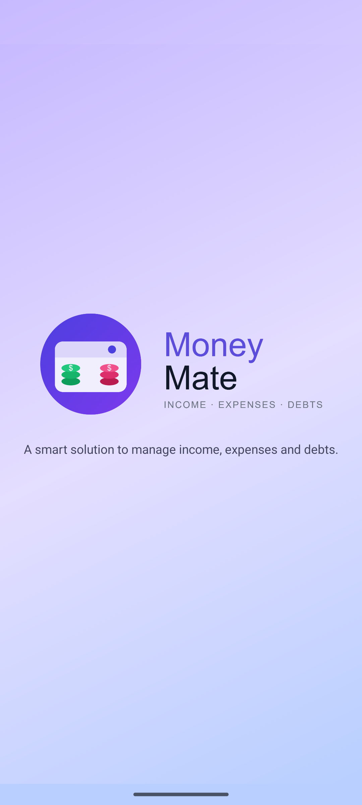 | 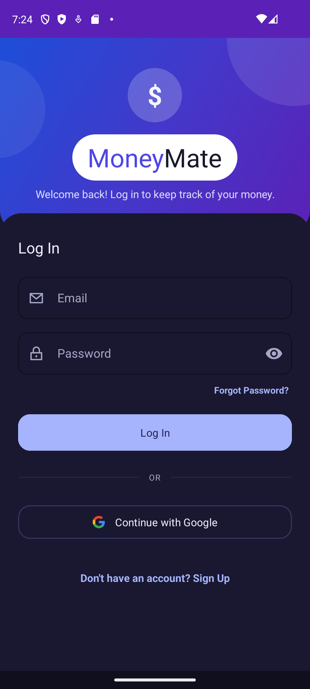 | 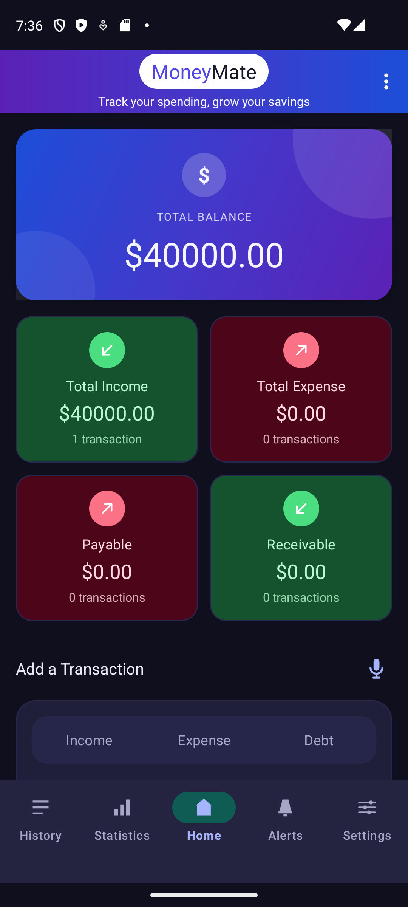 |

| Statistics + Ask MoneyMate AI | AI suggestions | AI answer |
|---|---|---|
| 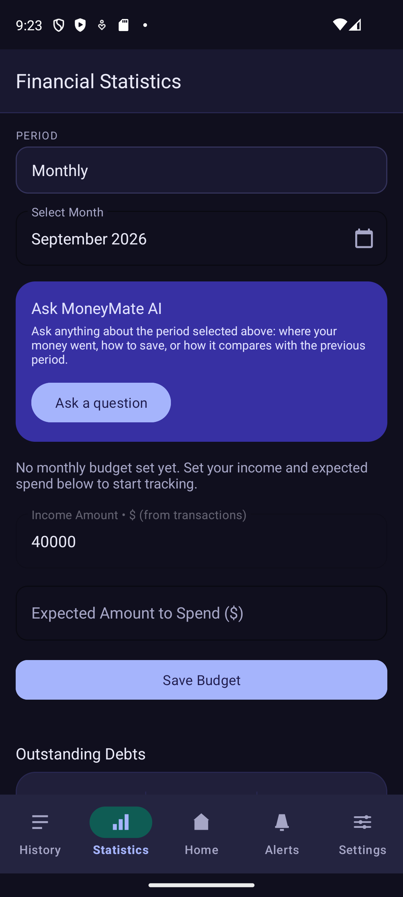 | 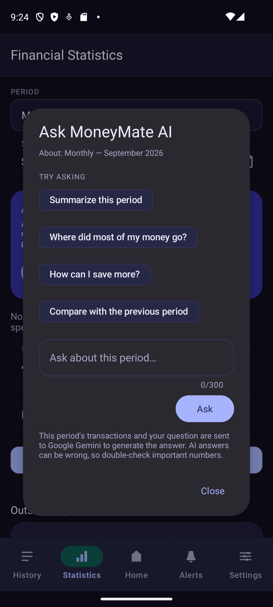 | 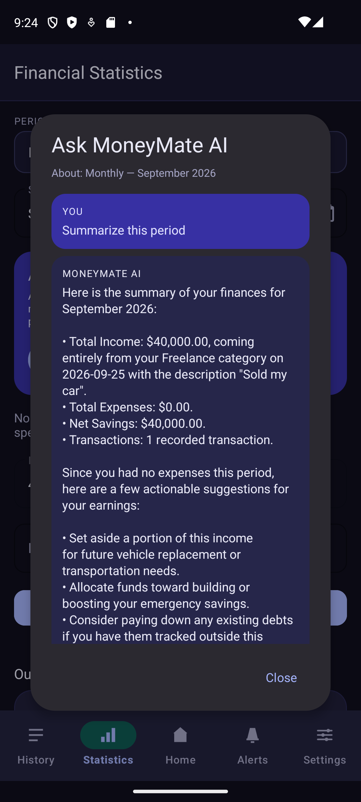 |

| Transaction History | Settings | Smart Voice setting |
|---|---|---|
| 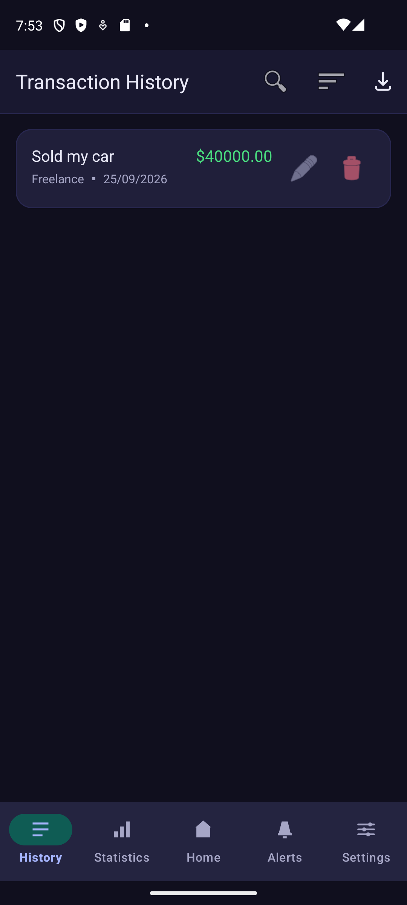 | 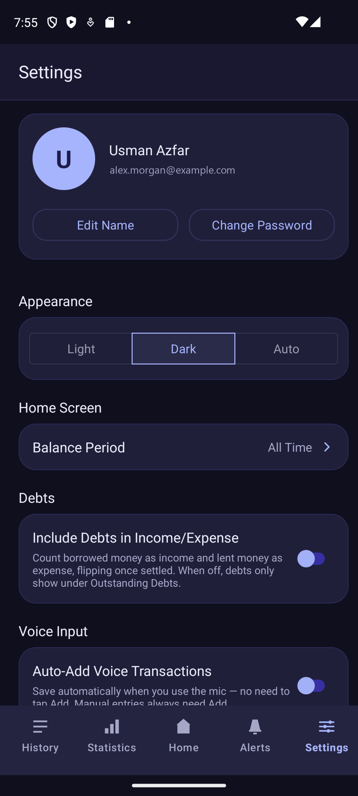 | 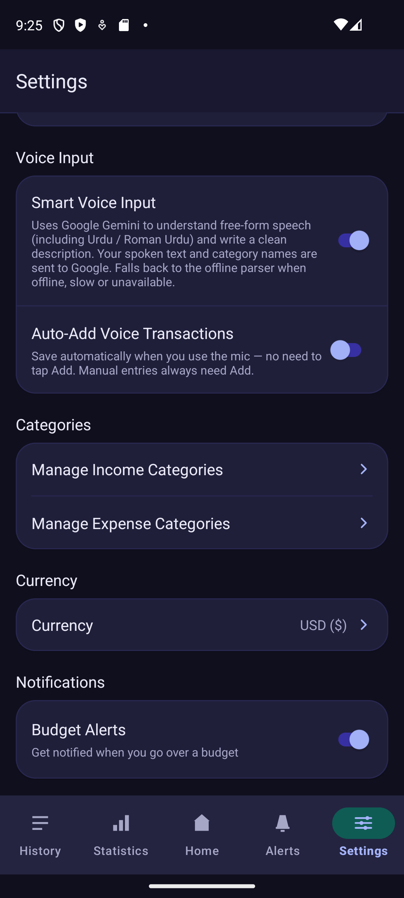 |

| Sign Up | Budget view | |
|---|---|---|
| 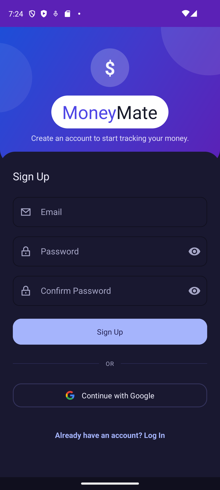 | 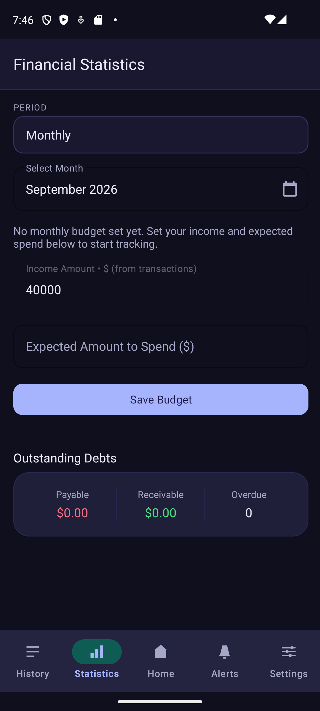 | |

*Debug build on a Pixel 8 emulator, dark theme. Balances are test data. The AI answer is a real Gemini response to that test data.*

## Features

### Core transaction tracking
- Add **Income**, **Expense** or **Debt** entries with a description, amount, date (backdating allowed, future dates blocked) and category.
- User-customizable category lists per type, seeded from sensible defaults.
- Home shows the 5 most recent transactions. **Transaction History** shows everything, with live search (description or person name) and filters by type and date range.
- Edit and delete any past transaction.
- Balance safeguards: an expense larger than the available balance is rejected, and deleting or editing income is blocked when it would push the balance below zero.

### Debt tracking (Payable / Receivable)
- Log money you **owe** (Payable) or money **owed to you** (Receivable), with the person's name and a due date.
- Mark a debt **settled** with one tap once it's paid or collected. Overdue debts are highlighted in red, and Home shows a banner counting them.
- Optional **"Include Debts in Income/Expense"** mode. When on, an unsettled Payable counts as income (cash you're holding) and an unsettled Receivable counts as expense (cash you've lent out). Each one flips the moment it's settled, so a full borrow-and-repay cycle nets to zero. When off, debts are tracked separately under "Outstanding Debts".

### Statistics & budgets
- Switch between **Daily / Weekly / Monthly / Yearly / Custom / All Time** views.
- Set an expected-spend budget for a *specific* week, month or year (e.g. a separate budget for each month), and track actual against expected with an animated progress bar.
- Income for the period is calculated live from real Income transactions rather than typed in, so it's always current.
- Category breakdown as an animated, hand-drawn donut chart plus a ranked list. Percentages use largest-remainder rounding so they always add up to exactly 100%.
- Android system notifications when a period's spending passes its budget, or when spending exceeds income. Each alert fires at most once per cycle, and there's a master mute switch in Settings.
- An **Alerts** tab keeps the in-app history of every alert, with Clear All.

### Voice-command transaction entry (on-device)
- Tap the mic on Home and speak a transaction, e.g. *"Spent 500 on groceries yesterday"* or *"Borrowed 15000 from my brother due next month"*.
- Speech-to-text uses the **system's own recognizer** (`RecognizerIntent`), so the app needs **no microphone permission** at all.
- By default the transcript is parsed **entirely on the device** by a hand-written, dependency-free parser. It extracts:
  - **Type** (Income / Expense / Payable / Receivable) from verb keywords, defaulting to Expense when there's an amount but no verb.
  - **Amount**, including digits, spelled-out numbers, "k" shorthand, comma separators and South Asian units (**lakh, crore**). For example, *"1 lakh 30 thousand"* becomes 130,000.
  - **Category**, matched only against the user's real categories plus a curated synonym table. An unrecognized merchant (e.g. "KFC") is left blank rather than guessed.
  - **Date / due date**, including relative phrases like "next Friday", "in 2 weeks" or "3 days ago".
  - **Person name** for debts, skipping possessive words ("my brother" → *Brother*).
- The result **pre-fills the form for review**. Nothing is saved without confirmation unless "Auto-Add Voice Transactions" is turned on in Settings.
- Backed by **27 unit tests**.

### Smart Voice Input (optional, Gemini)
- Off by default. Turn it on in **Settings → Voice Input → Smart Voice Input**.
- Only the transcript **text** (never audio), the user's category names and today's date are sent to Google Gemini. Gemini returns one transaction as **schema-constrained JSON**.
- It handles free-form phrasing and **Urdu / Roman Urdu**. For example, *"kal 500 ka petrol dalwaya"* becomes a ₨500 Transportation expense dated yesterday. It also **writes its own short description** (e.g. *"Petrol Expense"*), because people rarely say one.
- Every field is re-validated on the device before it reaches the form: the category must match one of the user's categories, dates must be real, the transaction date can't be in the future, and debt-only fields are dropped for Income/Expense.
- **Falls back to the on-device parser automatically** when there's no network, the request fails or takes longer than 8 seconds, or Gemini returns nothing usable. Either way the form is pre-filled for review.
- Backed by **16 unit tests** of request building and response validation.

### Ask MoneyMate AI (Statistics, Gemini)
- Pick any period on the Statistics screen, tap **Ask a question**, then type a question or tap a suggestion such as "Summarize this period", "Where did most of my money go?", "How can I save more?" or "Compare with the previous period".
- The model receives a compact summary of **exactly the period on screen**:
  - totals, plus the previous period's totals and category breakdown for comparison
  - budget progress
  - expense and income by category
  - outstanding and overdue debts
  - up to 150 transaction lines
- Answers quote the user's real numbers in their chosen currency and arrive as plain text. The model is told to say so when the data doesn't cover the question, and to decline off-topic requests.
- **Follow-up questions** keep the last 3 exchanges for context. Answers come back in the language of the question (English, Urdu or Roman Urdu).
- Reliability:
  - a 25-second deadline, with one automatic retry when Gemini is briefly overloaded (HTTP 429/5xx)
  - closing the dialog cancels a request that's still running
  - separate messages for offline, timeout, busy and blocked
  - after a failure the question is put back in the box, so a retry is one tap
- The dialog states clearly that the data is sent to Google Gemini and that AI answers can be wrong.
- Backed by **12 unit tests** of the data summary, the request body, answer clean-up and response parsing.

### Reports & export
- Export the **currently filtered** History list as a formatted, multi-page **PDF** (drawn with `android.graphics.pdf`, no PDF library) or a spreadsheet-ready **CSV**. Both formats include totals and outstanding debts.
- Optionally set a default export format in Settings to skip the "PDF or CSV?" prompt.

### Personalization
- **37 world currencies** with a searchable picker. This changes the symbol shown everywhere; amounts aren't converted.
- Light / Dark / follow-system theme, with a complete, separately maintained dark palette.
- Configurable **Balance Period** for the Home dashboard (All Time, or a specific day, week, month, year or custom range).
- Branded gradient splash screen, and an in-app **User Guide** explaining every feature.

### Accounts & security
- Firebase Authentication with email/password (**email verification required** before first sign-in) and **Google Sign-In** through Credential Manager.
- Forgot-password and change-password flows, and an editable display name.
- Optional **App Lock**:
  - a 4-digit PIN (stored only as a salted SHA-256 hash) and/or fingerprint unlock
  - shown on cold start and whenever the app returns from the background
  - 5 wrong attempts trigger a 30-second lockout
  - "Forgot passcode" requires signing in again with the account's password or Google before a new PIN can be set

### Cloud sync
- Transactions are stored locally first and mirrored to **Cloud Firestore**, so the app is fully usable offline.
- Changes made offline wait in a queue and are replayed automatically as soon as connectivity returns, triggered by a network listener. There's also a manual **Sync Now** in Settings.
- Signing in on a new device downloads that account's transactions.

## Tech stack

| Layer | Choice |
|---|---|
| Language | Kotlin |
| UI | Android Views + ConstraintLayout + Material Components 3 (no Compose) |
| Local persistence | `SharedPreferences` + Gson |
| Cloud backend | Firebase Authentication, Cloud Firestore |
| Auth providers | Email/password, Google Sign-In (Credential Manager + `googleid`) |
| AI | Google Gemini REST API (`generateContent`, JSON output constrained by a schema), called through plain `HttpURLConnection` with no SDK |
| Charts | Custom `View` (hand-drawn donut chart), no charting library |
| PDF/CSV export | `android.graphics.pdf.PdfDocument` / plain text, no export library |
| Voice input | `RecognizerIntent` (system speech-to-text) + on-device parser, with optional Gemini parsing |
| Security | AndroidX Biometric, salted SHA-256 PIN hash |
| Testing | JUnit4: 56 unit tests (voice parser, Gemini voice validation, AI advisor) |
| Build | Gradle Kotlin DSL, AGP 8.13, version catalog (`libs.versions.toml`) |

**Deliberately not used:** Jetpack Compose, Room, Hilt/Dagger, Retrofit/OkHttp, a Gemini/AI SDK, a charting library or a PDF library. For this app's actual needs (one user's transaction list, cached locally and mirrored to Firestore, plus two small AI calls), they would add build complexity and third-party code without a real benefit. A `SharedPreferences` + Gson repository, a couple of hundred lines of Canvas drawing and a ~200-line HTTP client do the job and stay easy to reason about.

## Architecture notes

- **Repository pattern with singletons**, not a database. `TransactionRepository`, `BudgetRepository`, `CategoryRepository` and the rest are Kotlin `object`s wrapping `SharedPreferences` + Gson, all with the same shape. Each screen re-reads in `onResume()`, which avoids stale data when switching tabs.
- **`SyncManager`** is the only code that talks to Firestore. Screens read only from the local store. Firestore documents are read and written as plain `Map`s rather than through automatic object mapping, to avoid problems with Kotlin data classes.
- **`GeminiClient`** is the only code that talks to Gemini. It runs requests on a background thread with a hard overall deadline, one retry for 429/5xx errors when enough time is left, cancellation, and exactly one callback on the main thread. The two AI features only build requests and interpret responses, and those parts are pure functions, so all their logic is unit-tested without a network.
- **The AI features use a "validate, then fall back" design.** Voice answers are checked against the user's own data before use, and invalid ones fall back to the deterministic parser. Advisor answers are cleaned of Markdown before display. The assistant is read-only, and voice results only pre-fill the form for review, unless the user has explicitly turned on Auto-Add.
- **`DebtAccounting`** is the single source of truth for how a transaction counts toward income or expense (see Highlights).
- **Activity-based navigation**, not Fragments or the Navigation Component. There are five bottom-nav destinations (Home, History, Statistics, Alerts, Settings), each its own Activity, sharing a small `BottomNavHelper`.
- **Two-tier color system.** `colors.xml` and `values-night/colors.xml` define the same color names with different values per theme. Colors tied to fixed artwork (the logo, the splash gradient) are deliberately *not* theme-aware, so dark mode can never make them unreadable.

## Project structure

```
app/src/main/java/com/yourname/expensetrackerapp/
├── Transaction.kt, TransactionRepository.kt       # Core data model + persistence
├── MainActivity.kt, TransactionsActivity.kt       # Home dashboard, full history
├── StatisticsActivity.kt, BudgetRepository.kt,
│   BudgetPeriod.kt, PeriodType.kt, PeriodWindow.kt # Periods, budgets, category breakdown
├── DebtAccounting.kt, IncludeDebtsPrefs.kt         # Debt-as-income/expense rules
├── SpeechInputHelper.kt, TransactionVoiceParser.kt,
│   VoiceKeywords.kt                               # On-device voice pipeline
├── GeminiClient.kt                                # Shared Gemini HTTP client
├── GeminiTransactionParser.kt, SmartVoicePrefs.kt  # Smart Voice Input
├── AiAdvisor.kt, AiAdvisorDialog.kt               # Ask MoneyMate AI
├── PdfReportGenerator.kt, CsvReportGenerator.kt,
│   FileDownloader.kt                              # Report export
├── AuthRepository.kt, AuthFlow.kt, GoogleAuthHelper.kt,
│   LoginActivity.kt, SignUpActivity.kt            # Firebase auth
├── SyncManager.kt, UserRepository.kt              # Cloud sync
├── AppLockManager.kt, AppLockPrefs.kt, LockScreenActivity.kt,
│   PasscodeSetupActivity.kt, PasscodeResetActivity.kt # PIN/biometric app lock
├── BudgetNotifier.kt, NotificationHelper.kt,
│   NotificationsActivity.kt                       # Budget alerts
├── CurrencyPrefs.kt, CurrencyPickerActivity.kt     # Multi-currency display
├── CategoryRepository.kt, CategoriesActivity.kt   # Custom categories
├── SettingsActivity.kt, ThemePrefs.kt, UserGuideActivity.kt
└── BrandName.kt, DonutChartView.kt, ...           # Shared UI helpers

app/src/test/java/com/yourname/expensetrackerapp/
├── TransactionVoiceParserTest.kt                  # 27 tests: on-device voice parser
├── GeminiTransactionParserTest.kt                 # 16 tests: Smart Voice request/validation
└── AiAdvisorTest.kt                               # 12 tests: AI data summary, request, parsing
```

## Getting started

### Prerequisites
- Android Studio (recent stable release) and JDK 11
- An Android device or emulator running API 24 (Android 7.0) or higher
- A [Firebase](https://firebase.google.com/) project, for authentication and sync
- *(Optional)* A [Google AI Studio](https://aistudio.google.com/) Gemini API key, for Smart Voice Input and Ask MoneyMate AI

### Setup
1. Clone the repository.
2. Create a Firebase project and enable **Authentication** (Email/Password and Google providers) and **Cloud Firestore**. Download your own `google-services.json` into `app/`. This file is git-ignored.
3. *(Optional, for the AI features)* Add your Gemini key to the git-ignored `local.properties` in the project root:
   ```properties
   GEMINI_API_KEY=your-key-here
   # optional, defaults to gemini-3.5-flash-lite
   GEMINI_MODEL=gemini-3.5-flash-lite
   ```
   Without a key the app still builds and runs: Smart Voice shows as unavailable and the Ask MoneyMate AI card is hidden.
4. Open the project in Android Studio and let Gradle sync, then run it. From the command line: `./gradlew.bat :app:assembleDebug` (Windows) or `./gradlew :app:assembleDebug` (macOS/Linux).

### Running the tests
```bash
./gradlew.bat :app:testDebugUnitTest
```

## Known gaps / honest limitations

- **Gemini key handling:** the key is kept out of source control, but it is compiled into the APK and could be extracted. Before any public release, restrict the key to the app's package and signing certificate in Google Cloud Console, or move the calls behind a backend such as Firebase AI Logic.
- **Privacy:** both AI features are opt-in and say that data goes to Google Gemini, but they do send transaction details to a third-party service. AI answers can occasionally misstate a number, which the dialog warns about.
- **Sync coverage:** only transactions are synced. Budgets, categories, alert history and preferences stay on the device, and debt details (person, due date, settled state) aren't mirrored to Firestore yet, so they don't survive a reinstall or a move to a new device.
- The device keeps the 200 most recent transactions once they're synced; older ones live only in Firestore.
- Automated tests cover the parsing, validation and AI logic (56 unit tests). There is no instrumented UI test suite yet.
- Currency is display-only; changing it doesn't convert historical amounts.
- The application ID (`com.yourname.expensetrackerapp`) is a placeholder and should be changed before publishing to the Play Store.
- **No `LICENSE` file is included yet.** An earlier README claimed an MIT license, which was inaccurate. Add a `LICENSE` file before open-sourcing under a specific license.

## Roadmap

- [x] LLM-powered voice parsing (Smart Voice Input) with on-device fallback
- [x] AI finance assistant grounded in the user's own data (Ask MoneyMate AI)
- [ ] Sync debt details, budgets and categories to Firestore
- [ ] Move Gemini calls behind a backend (Firebase AI Logic / Cloud Functions) with per-user quotas
- [ ] Recurring/scheduled transactions
- [ ] Multi-account / shared household budgets
- [ ] Instrumented UI test suite

---

<div align="center">

**Usman Azfar**
[usmanazfarshafiq@gmail.com](mailto:usmanazfarshafiq@gmail.com)

</div>
